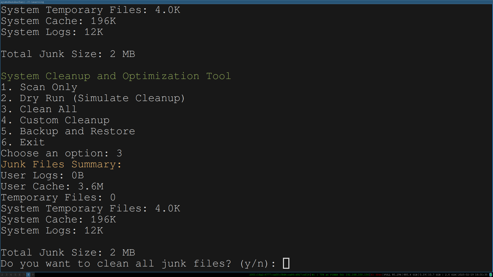
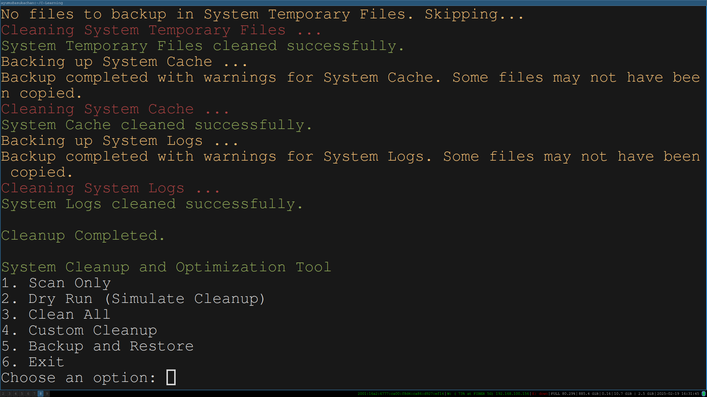
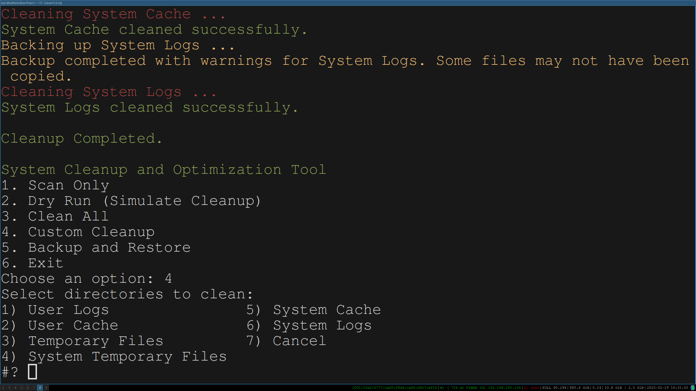

# Ultimate Linux System Cleaner & Optimizer

Boost your Linux system's performance, free up disk space, and keep it clutter-free effortlessly.

---

## Features:
- Safe Cleanup: Remove junk files, caches, and logs without breaking your system.
- Automatic Backup & Restore: No risk of accidental deletions.
- Dry Run Mode: See what will be deleted before committing.
- Detailed Logging: Full transparency of what’s being cleaned.
- Lightweight & Fast: No bloat, just an efficient terminal tool.

---

## Installation:
1. Download the script: `cleaner.sh`
2. Make it executable:
   ```bash
   chmod +x cleaner.sh

## Screenshots

### Main Menu


### Scan & Junk Summary


### Cleanup in Progress



